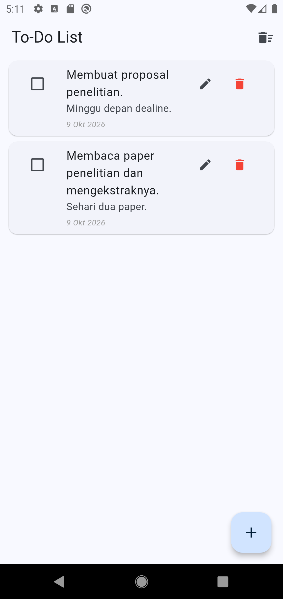
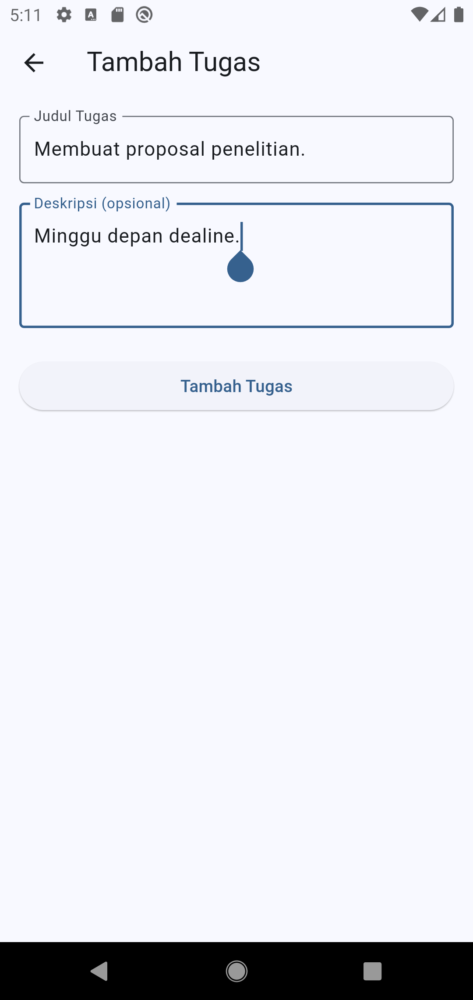

# 📝 To-Do List App

Aplikasi **To-Do List** sederhana yang dikembangkan menggunakan **Flutter dan Dart**. Aplikasi ini membantu pengguna mencatat tugas, menambahkan deskripsi, mengelola status penyelesaian, serta menyimpan data secara lokal menggunakan SQLite.

Project ini dibuat sebagai contoh penerapan pengembangan aplikasi mobile dengan Flutter, mulai dari pembuatan antarmuka pengguna (GUI), pengelolaan form, navigasi antarlayar, hingga operasi CRUD (*Create, Read, Update, Delete*) menggunakan database lokal.

## 📱 Screenshots
<p align="center">
  
  &nbsp;&nbsp;
  
</p>

### 1. Daftar Tugas

Halaman utama menampilkan daftar tugas yang tersimpan di database. Pengguna dapat melihat judul, deskripsi, tanggal pembuatan, dan status penyelesaian setiap tugas.

### 2. Form Tambah Tugas

Halaman form digunakan untuk menambahkan tugas baru atau mengedit tugas yang sudah ada. Pengguna dapat mengisi judul tugas dan deskripsi tambahan.

> **Catatan:** Ganti gambar contoh dengan screenshot aplikasi yang sebenarnya. Simpan kedua gambar di folder `screenshots` dengan nama file yang sesuai.

## ✨ Features

* ➕ **Tambah Tugas**
  Menambahkan tugas baru dengan judul dan deskripsi opsional.

* 📋 **Daftar Tugas**
  Menampilkan seluruh tugas yang tersimpan dalam database lokal.

* ✏️ **Edit Tugas**
  Memperbarui judul dan deskripsi tugas yang sudah ada.

* ✅ **Tandai Tugas Selesai**
  Mengubah status tugas melalui checkbox.

* 🗑️ **Hapus Tugas**
  Menghapus tugas tertentu setelah pengguna memberikan konfirmasi.

* 🧹 **Hapus Tugas yang Selesai**
  Menghapus seluruh tugas yang telah ditandai selesai.

* 💾 **Penyimpanan Lokal**
  Menggunakan SQLite agar data tetap tersimpan meskipun aplikasi ditutup.

* 🔄 **Pembaruan Daftar Otomatis**
  Memuat kembali daftar tugas setelah penambahan, pengeditan, atau penghapusan data.

* 🛡️ **Validasi Form**
  Memastikan judul tugas tidak boleh kosong.

* ⏳ **Indikator Loading**
  Menampilkan indikator saat data sedang dimuat atau disimpan.

## 🛠️ Built With

Project ini menggunakan teknologi dan package berikut.

| Teknologi       | Kegunaan                                                      |
| --------------- | ------------------------------------------------------------- |
| Flutter         | Framework untuk membangun antarmuka aplikasi mobile           |
| Dart            | Bahasa pemrograman yang digunakan dalam pengembangan aplikasi |
| Material Design | Komponen antarmuka pengguna                                   |
| SQLite          | Database relasional untuk penyimpanan data lokal              |
| `sqflite`       | Package untuk mengakses database SQLite dari Flutter          |
| `path`          | Package untuk mengelola dan menggabungkan path file database  |

## 📂 Project Structure

Struktur folder project disusun untuk memisahkan antarmuka pengguna, model data, dan pengelolaan database.

```text
todo_list/
├── lib/
│   ├── main.dart
│   │
│   ├── models/
│   │   └── todo.dart
│   │
│   ├── database/
│   │   └── database_helper.dart
│   │
│   └── screens/
│       ├── todo_list_screen.dart
│       └── todo_form_screen.dart
│
├── screenshots/
│   ├── todo-list.png
│   └── todo-form.png
│
├── android/
├── ios/
├── test/
├── pubspec.yaml
└── README.md
```

### Penjelasan Folder dan File

| File atau Folder                | Fungsi                                                                     |
| ------------------------------- | -------------------------------------------------------------------------- |
| `main.dart`                     | Titik masuk aplikasi dan konfigurasi `MaterialApp`.                        |
| `models/todo.dart`              | Mendefinisikan model `Todo` dan konversi data antara objek Dart dan `Map`. |
| `database/database_helper.dart` | Mengelola koneksi database serta operasi CRUD menggunakan SQLite.          |
| `screens/todo_list_screen.dart` | Menampilkan daftar tugas dan menyediakan fitur pengelolaan tugas.          |
| `screens/todo_form_screen.dart` | Menyediakan form untuk menambahkan dan mengedit tugas.                     |
| `screenshots/`                  | Menyimpan gambar screenshot aplikasi untuk dokumentasi.                    |
| `pubspec.yaml`                  | Mendefinisikan konfigurasi project dan dependensi Flutter.                 |

## ⚙️ Requirements

Sebelum menjalankan project, pastikan perangkat pengembangan telah memiliki:

* Flutter SDK.
* Dart SDK yang sesuai dengan versi Flutter.
* Android Studio atau Visual Studio Code.
* Android Emulator atau perangkat Android fisik.
* Flutter dan Dart extensions jika menggunakan Visual Studio Code.

Untuk memeriksa instalasi Flutter, jalankan perintah berikut:

```bash
flutter doctor
```

Perintah tersebut akan memeriksa konfigurasi Flutter dan perangkat pengembangan yang diperlukan.

## 🚀 Getting Started

Ikuti langkah-langkah berikut untuk menjalankan aplikasi di komputer lokal.

### 1. Clone Repository

Unduh project dari GitHub menggunakan perintah:

```bash
git clone <repository-url>
```

Ganti `<repository-url>` dengan URL repository GitHub milikmu.

Masuk ke direktori project:

```bash
cd todo_list
```

Sesuaikan `todo_list` dengan nama direktori repository jika berbeda.

### 2. Install Dependencies

Jalankan perintah berikut untuk mengunduh package yang dibutuhkan:

```bash
flutter pub get
```

Package utama yang digunakan adalah:

```yaml
dependencies:
  flutter:
    sdk: flutter
  sqflite: ^2.0.0
  path: ^1.8.0
```

> **Catatan:** Versi di atas merupakan contoh deklarasi dependensi. Gunakan versi `sqflite` dan `path` yang tercantum dalam file `pubspec.yaml` project agar sesuai dengan konfigurasi yang digunakan.

### 3. Run Application

Pastikan emulator telah berjalan atau perangkat Android telah terhubung.

Jalankan aplikasi dengan perintah:

```bash
flutter run
```

Flutter akan melakukan proses build dan menjalankan aplikasi pada perangkat yang dipilih.

## 🗄️ Database Design

Aplikasi menggunakan SQLite dengan nama database `todo.db` dan tabel `todos`.

### Table: `todos`

| Column        | Data Type | Description                                                              |
| ------------- | --------- | ------------------------------------------------------------------------ |
| `id`          | INTEGER   | Primary key dengan auto-increment                                        |
| `title`       | TEXT      | Judul tugas                                                              |
| `description` | TEXT      | Deskripsi tugas                                                          |
| `isDone`      | INTEGER   | Status penyelesaian tugas: `0` untuk belum selesai dan `1` untuk selesai |
| `createdAt`   | TEXT      | Tanggal dan waktu pembuatan tugas dalam format ISO 8601                  |

Database dibuat secara otomatis ketika aplikasi pertama kali membuka database yang belum tersedia.

### Data Model

Class `Todo` merepresentasikan sebuah tugas dalam aplikasi.

Model tersebut memiliki method `toMap()` untuk mengubah objek `Todo` menjadi `Map<String, dynamic>` sebelum disimpan ke database, serta factory constructor `Todo.fromMap()` untuk mengubah hasil query database menjadi objek Dart.

Pemisahan model data dan pengelolaan database membantu menjaga struktur kode agar lebih terorganisasi.

## 🔄 CRUD Operations

Aplikasi menerapkan empat operasi utama database.

| Operation | Method                   | Description                                |
| --------- | ------------------------ | ------------------------------------------ |
| Create    | `insertTodo()`           | Menambahkan tugas baru ke database         |
| Read      | `getAllTodos()`          | Mengambil seluruh tugas dari database      |
| Read      | `getTodoById()`          | Mengambil tugas berdasarkan ID             |
| Update    | `updateTodo()`           | Memperbarui data tugas                     |
| Update    | `toggleTodoStatus()`     | Mengubah status penyelesaian tugas         |
| Delete    | `deleteTodo()`           | Menghapus tugas berdasarkan ID             |
| Delete    | `deleteCompletedTodos()` | Menghapus seluruh tugas yang sudah selesai |

Seluruh operasi tersebut dikelola melalui class `DatabaseHelper`, sehingga halaman aplikasi tidak perlu menuliskan query SQL secara langsung.

## 🧩 Concepts Implemented

Beberapa konsep pemrograman Flutter dan Dart yang diterapkan dalam project ini meliputi:

* **StatelessWidget dan StatefulWidget** untuk membangun antarmuka statis dan antarmuka yang membutuhkan pengelolaan state.
* **State Management dasar** menggunakan `setState()` untuk memperbarui tampilan setelah data berubah.
* **Navigation** menggunakan `Navigator.push()` dan `Navigator.pop()` untuk berpindah antara halaman daftar tugas dan halaman form.
* **Form Validation** menggunakan `Form`, `GlobalKey<FormState>`, dan `TextFormField`.
* **TextEditingController** untuk membaca dan mengelola input pengguna.
* **Asynchronous Programming** menggunakan `Future` dan `async/await` saat menjalankan operasi database.
* **Object-Oriented Programming** melalui class `Todo` dan `DatabaseHelper`.
* **Singleton Pattern** untuk menggunakan satu instance `DatabaseHelper`.
* **Local Database** menggunakan SQLite melalui package `sqflite`.

## 📌 Future Improvements

Beberapa fitur yang dapat dikembangkan pada versi berikutnya:

* 🔍 Pencarian tugas berdasarkan judul.
* 🗂️ Filter tugas berdasarkan status penyelesaian.
* ⭐ Prioritas tugas.
* 📅 Tenggat waktu atau *deadline*.
* 🔔 Pengingat tugas.
* 🎨 Tema gelap (*dark mode*).
* 🧪 Unit test untuk model dan operasi database.
* 🏗️ Pemisahan pengelolaan state menggunakan pendekatan seperti Provider atau Riverpod.

## 🎯 Learning Objectives

Project ini dapat digunakan sebagai bahan pembelajaran untuk memahami:

1. Struktur dasar aplikasi Flutter.
2. Pembuatan antarmuka menggunakan widget Material Design.
3. Pengelolaan input dan validasi form.
4. Navigasi antarlayar.
5. Pengelolaan state menggunakan `setState()`.
6. Pemrograman asinkron dengan `Future` dan `async/await`.
7. Pemodelan data menggunakan class Dart.
8. Operasi CRUD menggunakan database SQLite.
9. Pemisahan kode berdasarkan tanggung jawab masing-masing komponen.

## 👨‍💻 Author

**Uqifumi**

Flutter Developer | Mobile Application Development

---

⭐ Jika project ini bermanfaat untuk pembelajaran Flutter, jangan ragu untuk memberikan **star** pada repository ini.
